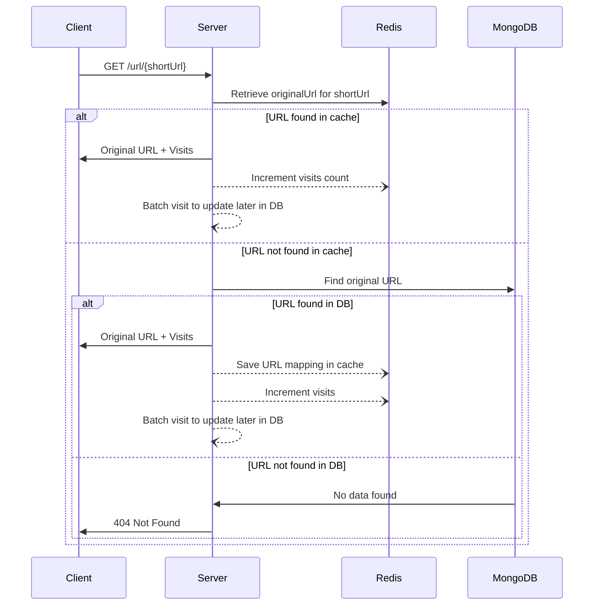
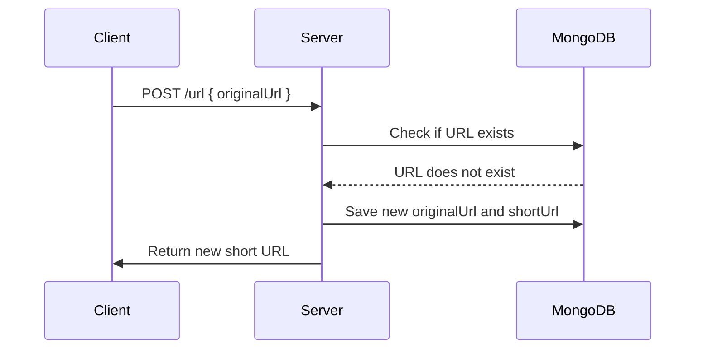

# url-shortner

### Notes for reviewer

**I have put inline multiple "NOTE" in the codebase for communicating my decision making. Revieweing them will be super helpful in evaluating what was going on in my mind while attempting this challenge**

> **Note**
> ⚠️ This is more or less an initial version of the app, certainly there will be a lot of things to improve on. I am more than happy to hear your feedback on this.

#### - Database

- The choice fell on MongoDB, given the nature of this as a straightforward CRUD application, a scenario in which MongoDB excels.
- As a NoSQL database, MongoDB presents the ease of horizontal scalability by integrating more nodes into the cluster. This feature aligns well with future application scaling plans.

#### - Maintaining visits on a shortUrl

- The choice for handling hot data leaned towards Redis.
- A bulk update logic has been established to periodically store cold data, or visit counts, in MongoDB.

#### - Caching

- Redis cache has been employed to manage the mapping from shortUrl to originalUrl. This strategy reduces database load and expedites the retrieval of originalUrl from a given shortUrl.
- Caching has been primarily applied for GET requests, considering their high frequency of use. However, the system is flexible enough to extend caching to POST requests, if necessary.

#### - Rate Limiting

- A straightforward in-memory rate limiter was adopted for this assignment. However, in a distributed setting, a distributed cache like Redis would be more suitable for storing rate limit data.
- Presently, the system employs a "fixed window" rate limiter. In a more expansive scenario, other sophisticated rate limiters like a sliding window or token bucket could be considered.
- With IP-based rate limiting, certain corner cases need careful handling. For instance, replaying an HTTP request with identical parameters could result in a rate limit hit.

#### - Authentication

- At this stage, the API does not necessitate any authentication.
- Implementing authentication mechanisms (e.g., API keys, OAuth, JWT) would be a productive move to regulate access to specific endpoints or monitor API usage by individual users.

#### - Testing

- An attempt was made to encapsulate all the edge cases within the unit tests, with Jest being the preferred testing framework.
- There was some exploration around testing the batch visit update logic. However, due to time constraints, this part was skipped for the time being. This critical piece of code will definitely be brought under test coverage in the future.

## Application Flows

1. A user requests the original URL for a given short URL.



2. A user requests a short URL for a given original URL.




## Pre Requisites

1. Docker
2. Docker-compose
3. Node.js, Redis, MongoDB _(if you want to run app without docker)_

## Setup Instructions

1. Clone the repository
2. Run `cd server`

#### Running the app

- Run `docker-compose up --build` _(`--detach` if you want to run app in background)_

#### Testing the app

- Run `npm run test`

## API Documentation

This API documentation provides details about the endpoints available in the Short URL service.

### Base URL

The base URL for all endpoints is `http://locahost:3009/api`.

### Endpoints

#### Create Short URL

**Description:** Create a short URL from the provided original URL.

Request cURL

```curl
curl --location 'http://localhost:3009/api/url' \
--header 'Content-Type: application/json' \
--data '{
    "originalUrl": "https://www.npmjs.com/package/nanoidd"
}'
```

Possible Responses

- If successful

  > STATUS: 200 OK
  >
  > ```json
  > {
  >   "shortUrl": "tier.app/<short-url>"
  > }
  > ```

- If originalUrl not provided in request body

  > STATUS: 400 Bad Request
  >
  > ```json
  > {
  >   "error": "\"originalUrl\" is required"
  > }
  > ```

- If invalid originalUrl is provided in request body

  > STATUS: 400 Bad Request
  >
  > ```json
  > {
  >   "error": "\"originalUrl\" must be a valid uri"
  > }
  > ```

- If rate limit hit _(60 requests per IP per hour allowed)_

  > STATUS: 429 Too Many Requests
  >
  > ```json
  > Too many requests, please try again later.
  > ```

#### Get Original URL

**Description:** Retrieve the original URL corresponding to the provided short URL.

```curl
curl --location 'http://localhost:3009/api/url/:shortUrl'
```

Possible Responses

- If URL found

  > STATUS: 200 OK
  >
  > ```json
  > {
  >   "originalUrl": "<original-url>",
  >   "visits": 7
  > }
  > ```

- If URL not found

  > STATUS: 404 Not Found
  >
  > ```json
  > {
  >   "error": "URL not found!"
  > }
  > ```

- If rate limit hit _(400 requests per IP per hour allowed)_

  > STATUS: 429 Too Many Requests
  >
  > ```json
  > Too many requests, please try again later.
  > ```
